# TaskMaster

the app have a three pages.

## 1- Home page

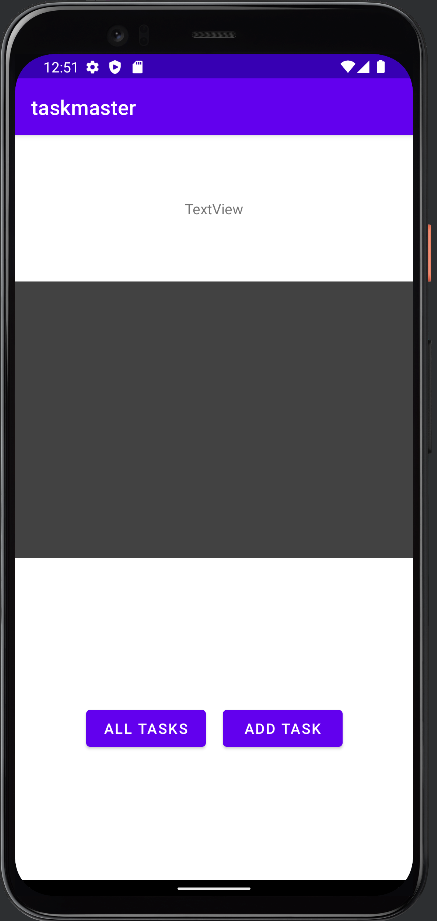

## 2- Add Task page

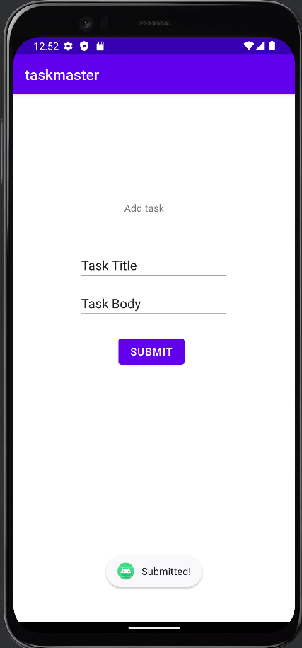

## 3- All Task page

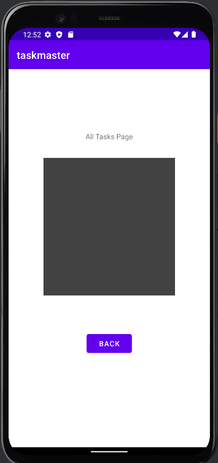

## 4- Setting page

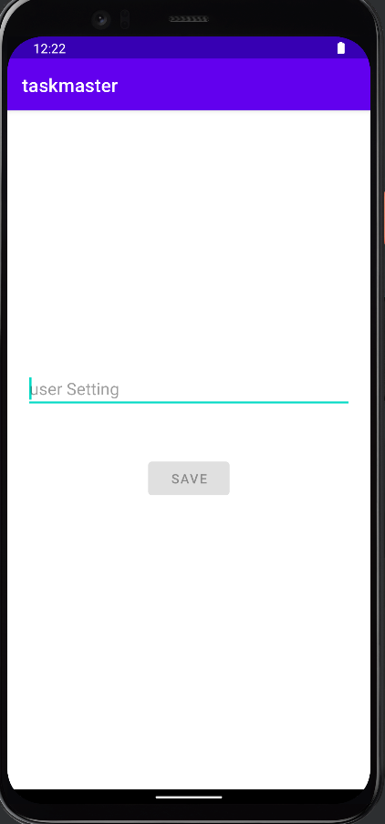

## 5- Task Details page

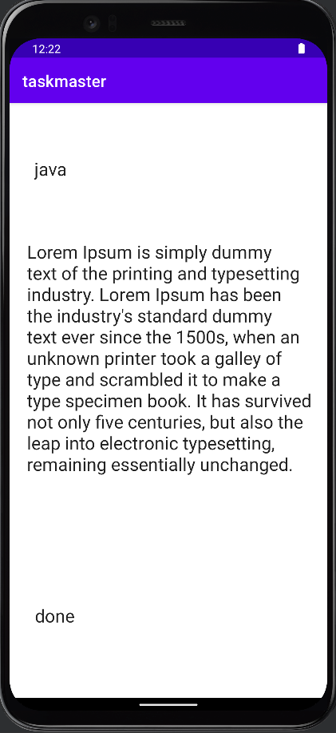

## 6- Recycler View

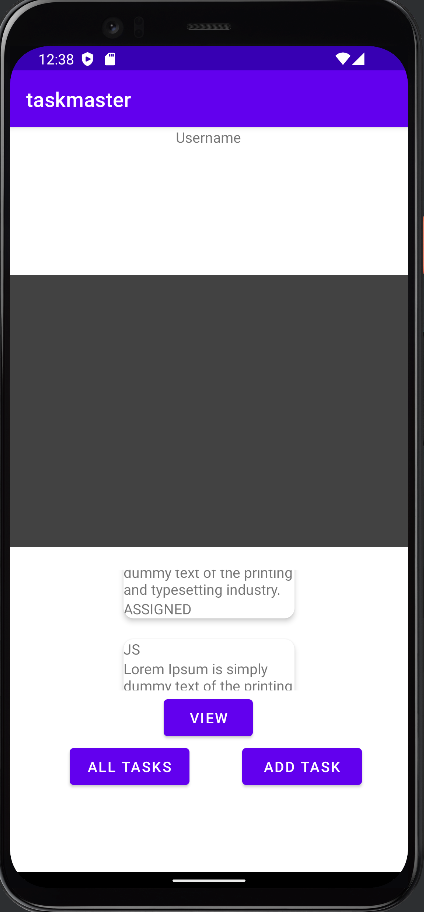

## 7- Room

Add Task Form: Modify your Add Task form to save the data entered in as a Task in your local database.

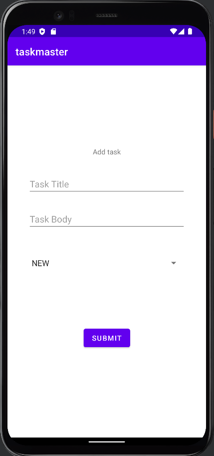

## 8- Amplify and DynamoDB

Modify your Add Task form to save the data entered in as a Task to DynamoDB.

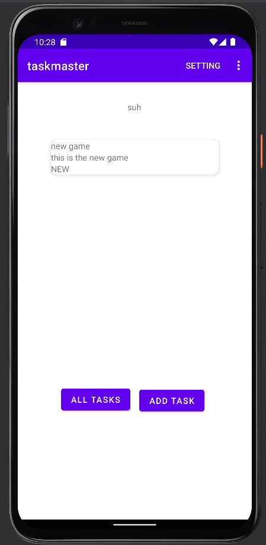

## 9- Related Data

Create a second entity for a team, which has a name and a list of tasks. Update your tasks to be owned by a team.

Manually create three teams by running a mutation exactly three times in your code. (You do NOT need to allow the user to create new teams.)

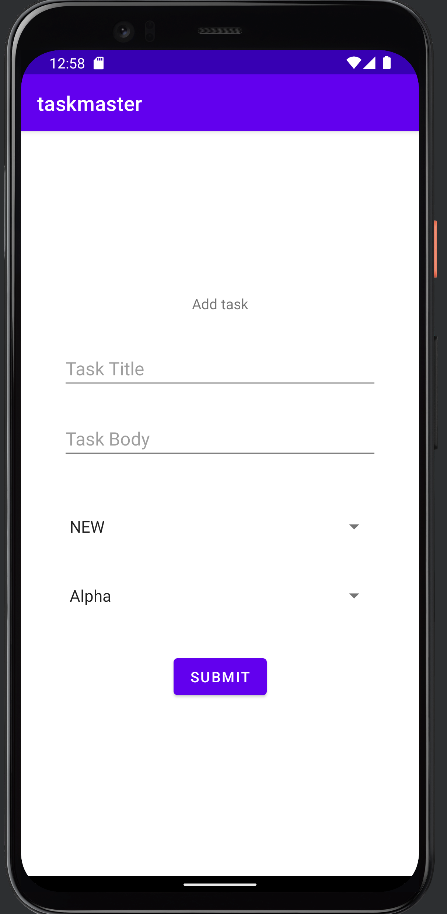

## Publishing to the Play Store

Publishing is the general process that makes your Android applications available to users. When you publish an Android application you perform two main tasks: You prepare the application for release. During the preparation step you build a release version of your application, which users can download and install on their Android-powered devices.

You release the application to users. During the release step you publicize, sell, and distribute the release version of your application to users.

Preparing your app for release Preparing your application for release is a multi-step process that involves the following tasks:

Configuring your application for release. Building and signing a release version of your application. Testing the release version of your application. Updating application resources for release. Preparing remote servers and services that your application depends on. Releasing your app to users You can release your Android applications several ways. Usually, you release applications through an application marketplace such as Google Play, but you can also release applications on your own website or by sending an application directly to a user.

## Cognito

Add Cognito to your Amplify setup. Add in user login and sign up flows to your application, using Cognito’s pre-built UI as appropriate. Display the logged-in user’s username (or nickname) somewhere relevant in your app.

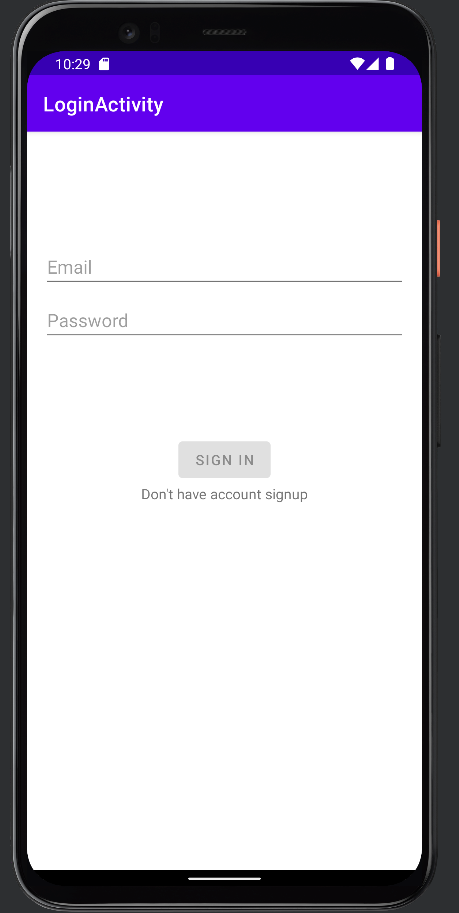
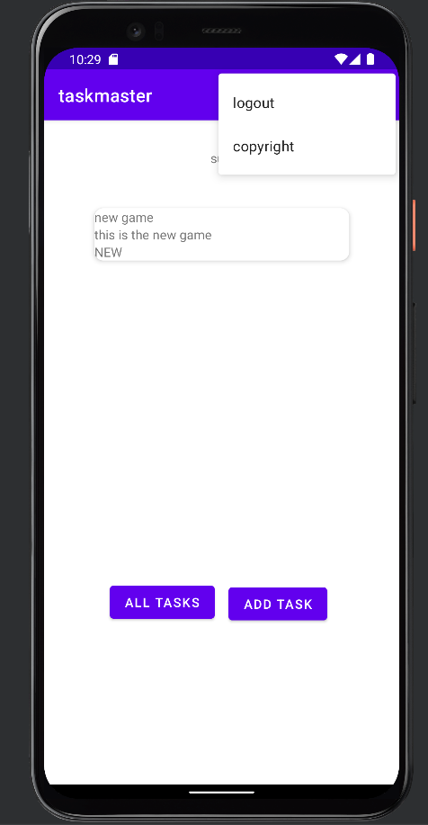
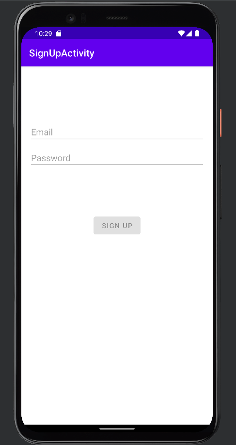

## S3

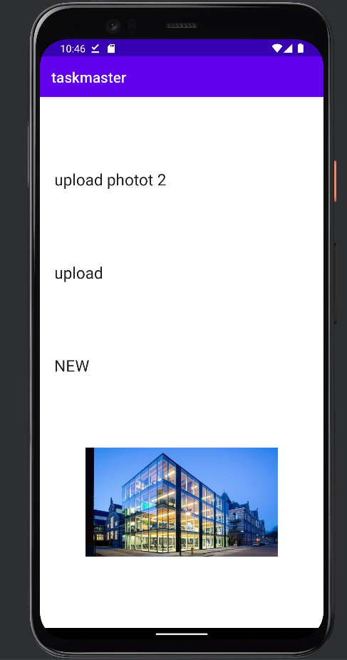
