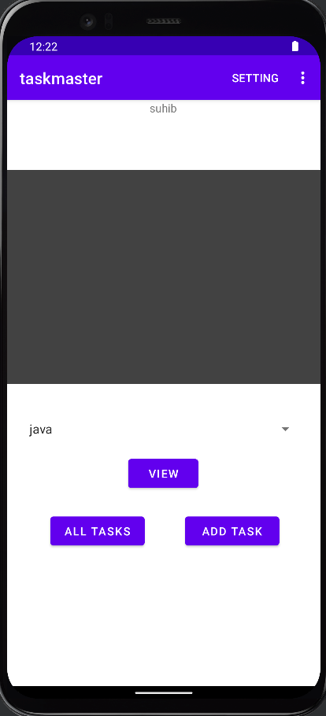

# TaskMaster

the app have a three pages.

## 1- Home page

## 2- Add Task page

## 3- All Task page

## 4- Setting page

## 5- Task Details page

## 6- Recycler View

## 7- Room

Add Task Form: Modify your Add Task form to save the data entered in as a Task in your local database.

## 8- Amplify and DynamoDB

Modify your Add Task form to save the data entered in as a Task to DynamoDB.

## 9- Related Data

Create a second entity for a team, which has a name and a list of tasks. Update your tasks to be owned by a team.

Manually create three teams by running a mutation exactly three times in your code. (You do NOT need to allow the user to create new teams.)

